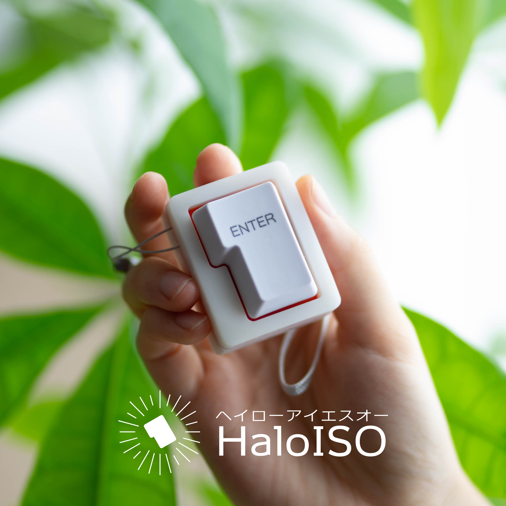

# HaloISO (ヘイローアイエスオー)

Enterキーのキーホルダー兼マクロパッド「HaloISO（ヘイローアイエスオー）」です。

:::
（初期モデル（バージョン表記無し）をお持ちの方へ）USBコネクタに裏表があります。USBケーブルで接続してもキーボードとして認識しない場合は、HaloISOに差し込む向きを逆にして接続してください。
:::

# 使い方

Enterキーをカチカチして楽しみます。

ケース上面にあるUSB-Cコネクターにお手持ちのUSB-Cケーブルを接続するとEnterキーが入力できるキーボードとして使用できます。

また、RGB LEDによるイルミネーション機能も搭載しています。

# RGB LEDのオン/オフのしかた

背面中央にあるRGB LEDは電源が入っていると常にゲーミングに点灯します。これをオフまたは再度オンにしたい場合は、「設定モード」に入れることで切り替えることができます。

# 設定モードへの入れ方

キーを押しながらケーブルを接続すると、HaloISOを「設定モード」に入れることができます。

設定モードに入れると、背面中央のRGB LEDが緑色に光ります。設定モードから戻る場合には、ケーブルを抜き差ししてください。

設定モードでは以下のことができます
- HaloISOへのプログラム書き込み
- RGB LEDのイルミネーションオン/オフ

# キーキャップの交換方法

HaloISOはCherry MXのEnterキー（a.k.a ISO Enter）のキーキャップに対応しています。お手持ちのEnterキーと交換する場合は、別途キーキャッププラー（引き抜き工具）を使って取り外してください。

# キースイッチの交換方法

キースイッチはホットスワップソケットによってはめ込まれているため、お手持ちのCherry MXキースイッチと交換することが可能です。

交換する際には、背面のネジ（#1）を4本外し、基板を取り外して行ってください。分解せずにキースイッチのみを引き抜くと、基板の脱落や破損の恐れがあります。

# ストラップの取り付け方

HaloISOにはストラップホールがあります。取り外しや交換を行う場合には、背面のネジをはずしてケースを分解して行ってください。

# プログラミング方法

HaloISOはマイコンを内蔵しており、これのプログラミングが可能です。

（記述中）

# 連絡先
ぺかそ (@Pekaso)
plusTK2S (at) gmail.com